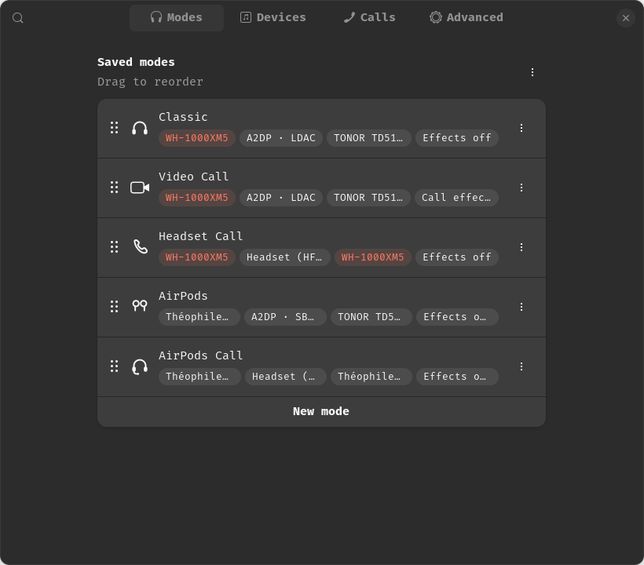

# Sound Modes

A GNOME Shell extension for anyone who reconfigures their audio setup more than once a
day — headphones for music, a USB mic for calls, earbuds for the commute, a headset when
the good microphone isn't worth the codec drop. Switching all of that by hand means
visiting the volume menu, the Bluetooth menu, and sometimes EasyEffects, every time.

Sound Modes lets you **save a complete audio setup as a mode and switch it in one click**.
A mode is an output device, an input device, a Bluetooth profile or codec, and optional
EasyEffects presets, bundled together. Devices are identified by stable PipeWire
properties (serial number, Bluetooth address, USB vendor/product), not by whatever name
happens to show up in the menu that day, so a mode still works after a reboot, a replug,
or a Bluetooth reconnect.



## Features

- **Output and input device selection**, matched on stable hardware identity rather than
  a transient device name.
- **Bluetooth profile and codec control** through PipeWire card profiles — A2DP, LDAC,
  AAC, HFP, whatever your headset actually offers, read from the card instead of guessed.
- **EasyEffects presets** per mode, with a scope of either "all applications" or "calls
  only", so a noise gate or EQ can apply everywhere or just to the app you're talking
  through.
- **Call detection**, so "calls only" knows what counts as a call: a WebRTC audio engine,
  a stream tagged with the `Communication` media role, an app using mic and speaker at
  the same time, or a manual override you set per app.
- **Auto-reconnect and re-apply**: if the active mode's devices disappear and come back
  (Bluetooth reconnect, USB replug, resume from suspend), the mode re-applies itself. If
  something's still missing, the mode shows as degraded until it isn't.
- **Fallback devices**, used when a mode's preferred device can't be found.
- **A panel button and a Quick Settings toggle**, so you can switch modes from wherever
  you'd expect to find them. The panel button is on by default and can be turned off in
  the preferences window's Advanced page.
- **Custom symbolic icons** for headphones, speakers, microphones, earbuds, headsets, and
  the various status states, instead of reusing generic Adwaita icons for everything.

## Requirements

- PipeWire and WirePlumber (standard on any current GNOME desktop).
- `pw-dump` and `pw-metadata` — part of `pipewire-bin` on Debian/Ubuntu (or the
  equivalent PipeWire tools package on your distro).
- `pactl` — part of `pulseaudio-utils`.
- GNOME Shell 46 through 51.
- Optional: [EasyEffects](https://github.com/wwmm/easyeffects), native or Flatpak, 7.x or
  8.x. Without it, everything except the effects section of a mode still works.

**A note on EasyEffects 8.x and Flatpak installs**: EasyEffects 7.x native exposes a
GSettings key the extension can flip to control whether it processes every app's audio or
only the one it's been pointed at. The 8.x rewrite (Qt-based) and any Flatpak install
don't expose that switch to the outside, so the extension can't toggle it for you. If
you're on 8.x or Flatpak and want "calls only" to actually behave like calls only, open
EasyEffects and turn off "process all outputs" yourself — the mode editor tells you this
when it applies.

## Install

From source:

```bash
git clone https://github.com/TheophileDiot/gnome-sound-modes
cd gnome-sound-modes
make install
```

Then re-login (Wayland) or restart GNOME Shell with `Alt+F2`, `r`, `Enter` (X11), and
enable it:

```bash
gnome-extensions enable sound-modes@theophilediot.github.io
```

extensions.gnome.org listing: coming.

## Quick start

Open the extension's preferences (from the Quick Settings menu, "Sound Modes
Settings…"), and pick **New mode → From current setup** to capture whatever you're
using right now as a starting point. From there you can change the output, input,
Bluetooth profile, and EasyEffects presets independently.

A common set of modes looks like this:

| Mode | Output | Input | Effects |
| --- | --- | --- | --- |
| Classic | Wireless headphones, A2DP/LDAC | USB microphone | Off |
| Video Call | Wireless headphones, A2DP/LDAC | USB microphone | On, calls only |
| Headset Call | Wireless headphones, HFP | Headphones' own mic | Off |
| Earbuds | Wireless earbuds, A2DP | USB microphone | Off |
| Earbuds Call | Wireless earbuds, HFP | Earbuds' own mic | Off |

The pattern: the "Call" variants swap in the headset's HFP profile (lower audio quality,
but the mic that comes with it) or add EasyEffects on top of the same A2DP setup when
you'd rather keep the USB mic and just clean up the call audio.

## How call-only routing works

With effects scope set to "calls only", music and everything else goes straight to your
output; only streams the call detector recognizes get routed through EasyEffects:

```
music / other apps ─────────────────────────► headphones
video call app     ──► EasyEffects (output) ──► headphones
USB microphone      ──► EasyEffects (input)  ──► video call app
```

Nothing else on the system is touched — a browser tab playing music next to an open
call keeps its own direct path.

## Troubleshooting

- **A mode is greyed out in the menu**: one of its devices isn't around. The label shows
  which one (`missing: …`). Plug it in, turn it on, or pair it, and the mode becomes
  selectable again.
- **A mode says "Will connect …"**: its Bluetooth device is paired but not connected.
  Clicking the mode connects it automatically before switching. Turn on the device if
  connection fails.
- **The audio quality isn't what I picked**: if the exact codec/profile you saved isn't
  currently offered by the device (firmware differences, a different adapter), the
  extension falls back to the closest match it can find and says so in the mode's status.
- **My headset switched profile from A2DP to HFP by itself**: that's WirePlumber's own
  `bluetooth.autoswitch-to-headset-profile`, kicking in because something started using
  the microphone. Sound Modes doesn't fight it — it shows the mode as degraded ("Headset
  is in a call") until the call ends, rather than switching the profile back mid-call.
- **Something's not working and you're not sure why**: turn on debug logging in the
  preferences window's Advanced page, then watch the journal:

  ```bash
  journalctl -f -o cat /usr/bin/gnome-shell
  ```

## Development

```bash
make test      # schema check + gjs unit tests (tests/test-*.js)
make install   # pack and install locally
```

Read-only probes against your live PipeWire/EasyEffects/BlueZ state live in
`tests/manual/` (`probe-pipewire.js`, `probe-easyeffects.js`, `probe-bluetooth.js`), run
with `gjs -m`; they only mutate anything when given an explicit `--apply` flag.

To try changes without logging out, run a nested Shell:

```bash
dbus-run-session -- gnome-shell --nested --wayland
```

See `CONTRIBUTING.md` for code layout and conventions.

## License

GPL-2.0-or-later. See `LICENSE`.
